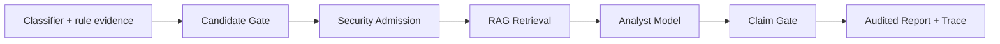

# Evidence-grounded Traffic Analysis Agent

[](https://github.com/jiapengLi11/vpn-anomaly-agent-platform/actions/workflows/ci.yml)
[](https://github.com/jiapengLi11/vpn-anomaly-agent-platform/actions/workflows/pages.yml)

一个面向异常加密通信排查的可审计 Agent 工程切片。它展示如何把分类信号、确定性规则证据和知识检索结果
组合给分析模型，同时用安全准入与 Claim Gate 防止 LLM 越权定性或触发自动处置。

> This is a synthetic-data engineering showcase, not a production detector or a release of any employer system.


## Why this project

很多 LLM 安全分析 Demo 直接把原始流量摘要丢给模型，再展示一段看似确定的结论。本项目把难点放在可控性：

- `SequenceClassifier` 是可替换接口，分类结果只是二级证据，不等于恶意概率。
- Candidate Gate 先筛选调查对象，零候选时短路 RAG 和模型调用。
- Security Admission 最多放行 20 条候选，稳定化名 IP/域名并移除本地路径。
- LangGraph 编排检索、分析、校验与收敛，所有节点产生可持久化 trace。
- Claim Gate 只接受带有效证据 ID 的观察、调查建议和限制说明。
- 最终 `securityVerdict` 固定为 `UNKNOWN`，不允许 LLM 自动封禁。

完整设计见 [architecture.md](docs/architecture.md)，前端重构过程见
[frontend-design-notes.md](docs/frontend-design-notes.md)。

## Architecture



核心状态机是 `security_admission -> knowledge_retrieval -> analyst_model -> claim_gate -> finalize`，另有
无候选短路分支。LangGraph 运行时与 Python 3.9 兼容执行器共享同一节点实现，便于渐进迁移。

## Run locally

Python 3.12（PowerShell）：

```powershell
python -m venv .venv
& .\.venv\Scripts\pip.exe install -r backend\requirements.txt
$env:PYTHONPATH="backend"
& .\.venv\Scripts\python.exe -m unittest discover -s backend\tests -v
& .\.venv\Scripts\python.exe -m traffic_agent.demo
```

Linux/macOS 使用 `PYTHONPATH=backend`。

启动 API：

```bash
uvicorn traffic_agent.api:app --app-dir backend --reload --port 8090
```

启动默认为合成数据只读模式的前端：

```bash
cd frontend
npm ci
npm run dev
```

访问 `http://127.0.0.1:8088`。也可以运行 `python tools/generate_demo.py` 重新生成同一份可复现 fixture。

## Verification

- 10 个 Agent/API 测试覆盖脱敏、候选上限、稳定化名、无候选短路、工具降级、引用校验和越权拒绝。
- Vue production build 已验证，`npm audit` 为 0 个已知漏洞。
- Playwright CLI 已验证 1440px 与 390px 关键页面，浏览器控制台 0 错误。
- CI 在 Python 3.12 重建合成数据，并执行后端测试和前端构建。

## Repository scope

公开内容只包含 Agent 控制面、通用分类器接口、合成数据和展示 UI。仓库明确排除 PCAP、模型权重、训练集、
私有知识文档、组织内部代码、环境路径和密钥。公开版的 `DemoSequenceClassifier` 是接口桩，不代表任何检测指标。

## Known limitations

- 自由文本目前只标记 `UNVERIFIED_NARRATIVE`，尚未做逐句语义蕴含验证。
- 合成演示使用确定性 analyst；接入外部 LLM 时仍需独立做 Prompt/模型评测。
- Element Plus 已按需加载，当前最大 JS 块约 198 KB；仍可继续做路由级预加载与性能度量。
- 图数据库、向量检索和训练分类器属于可插拔集成点，不在公开演示的运行依赖中。

## License

MIT. Synthetic demo only.
