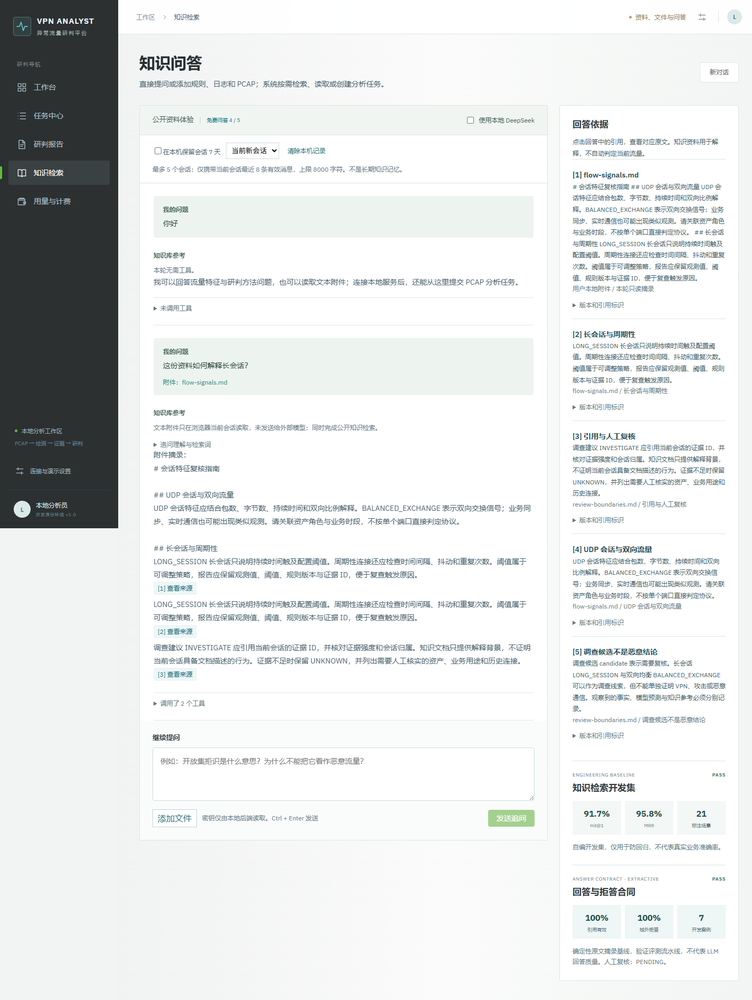
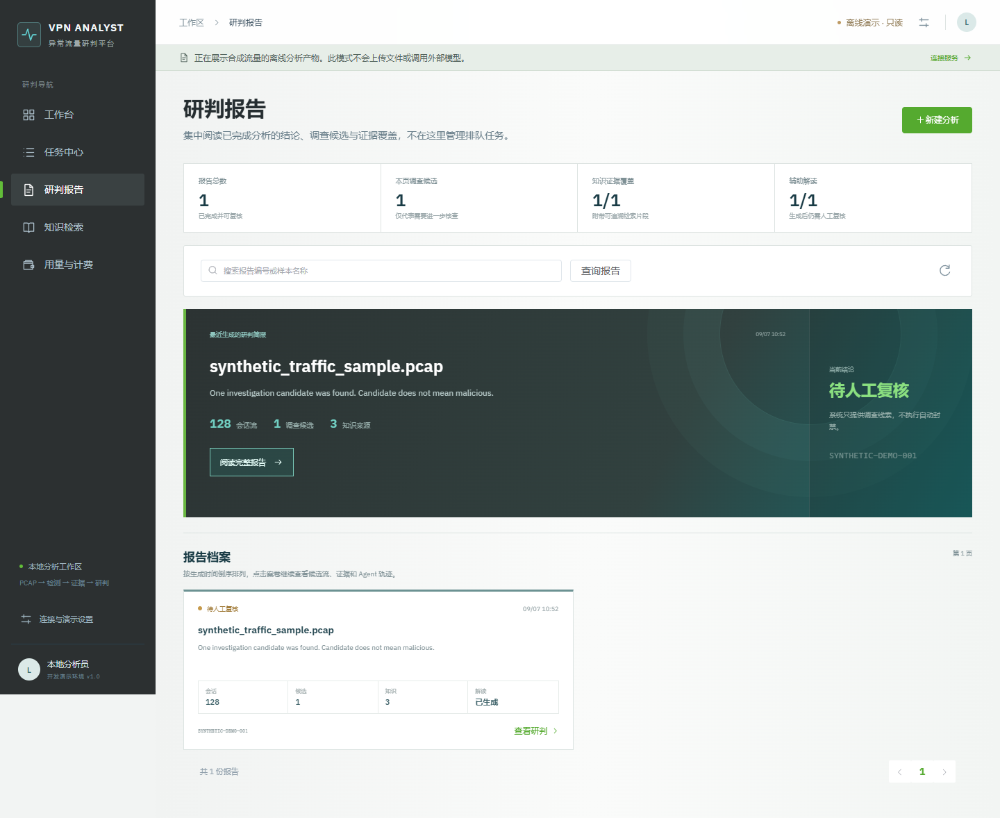
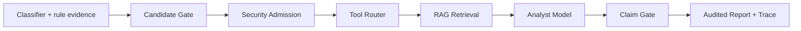

# Evidence-grounded Traffic Analysis Agent

[](https://github.com/jiapengLi11/vpn-anomaly-agent-platform/actions/workflows/ci.yml)
[](https://github.com/jiapengLi11/vpn-anomaly-agent-platform/actions/workflows/pages.yml)

一个面向异常加密通信排查的可审计 Agent 工程切片。它展示如何把分类信号、确定性规则证据和知识检索结果
组合给分析模型，同时用安全准入与 Claim Gate 防止 LLM 越权定性或触发自动处置。

> This is a synthetic-data engineering showcase, not a production detector or a release of any employer system.


## Why this project

很多 LLM 安全分析 Demo 直接把原始流量摘要丢给模型，再展示一段看似确定的结论。本项目把难点放在可控性：

- `SequenceClassifier` 是可替换接口，分类结果只是二级证据，不等于恶意概率。
- Candidate Gate 先筛选调查对象，零候选时短路 RAG 和模型调用。
- Security Admission 最多放行 20 条候选，稳定化名 IP/域名并移除本地路径。
- Tool Router 对主链做失败关闭；独立 Plan Compiler 演示从服务端注册表重建依赖、权限与串并行阶段。
- LangGraph 编排路由、检索、分析、校验与收敛，所有节点产生可审计 trace。
- Claim Gate 只接受带有效证据 ID 的观察、调查建议和限制说明。
- 最终 `securityVerdict` 固定为 `UNKNOWN`，不允许 LLM 自动封禁。

完整设计见 [architecture.md](docs/architecture.md)，前端重构过程见
[frontend-design-notes.md](docs/frontend-design-notes.md)。
已完成与待完成能力见 [实现状态](docs/implementation-status.md)。
[Tool Router 与分层评测](docs/tool-routing-and-evaluation.md)说明路由策略、评测边界及后续层次。
[回答质量开发基线](docs/answer-quality-evaluation.md)展示可复现的摘录模式实测、自动合同和人工复核边界。
[问答内工具控制面](docs/agent-orchestration.md)展示意图识别、服务端计划编译、运行策略与 SSE 审计闭环。

工具调用还提供一个受 Tool Router 约束的本地 MCP Bridge：`POST /api/mcp` 支持 `tools/list` 和 `tools/call`，
工具定义带 JSON Schema，未知工具和非法参数在执行前拒绝，分析调用继续经过 AgentWorkflow 和计费门禁。

## Tool control inside knowledge Q&A

自然语言、文本附件和 PCAP 共用知识问答入口，不再要求用户进入单独的 Agent 页面。系统不会把完整工具列表交给模型，而是先识别有限意图，再由服务端注册表重建依赖、权限、失败策略和 DAG。零工具说明直接回答；文本附件在浏览器当前会话只读解析，并与知识检索并行；PCAP 只有连接完整本地平台后才上传并创建异步任务。



[在线体验统一知识入口](https://jiapengli11.github.io/vpn-anomaly-agent-platform/#/knowledge)。公开站可完成零工具回答、文本只读摘录和浏览器知识检索；PCAP 上传需要本地完整平台，公开页面不会伪装为在线分析服务。旧 `#/agent` 地址仅重定向到知识页。

## Task and report workspaces

任务中心负责全状态任务管理、进度跟踪和失败定位；研判报告只收录已完成分析，并以最新简报、调查候选、知识证据覆盖和辅助解读状态组织阅读。两者共享同一份任务事实，但不再复用同一个页面组件。从报告中心进入详情时，导航和返回路径会保持在研判上下文。



## Usage and sandbox billing

公开演示还包含一个小型用量中心：新用户有 5 次分析和 5 次知识问答免费额度，成功请求按 requestId 幂等记录 token 与费用，失败或取消会释放预授权。页面支持微信/支付宝沙箱订单、模拟支付回调、余额、近 7 日 token 统计和流水查看；不会拉起真实支付，也不会产生真实资金交易。

实现细节和生产边界见 [用量与沙箱计费](docs/billing-and-usage.md)。真实支付仍需要商户证书、回调验签、退款、对账和统一身份认证，不能把本演示当作商业支付系统。

### 页面实拍

桌面端把免费额度、价格版本、7 日 token 使用和流水放在同一个成本治理页面：


充值流程只创建演示订单，不跳转真实支付渠道：


## Search the knowledge base

知识模块支持连续提问、文本附件、PCAP 任务入口、真实 SSE、停止生成、可选本机会话记忆、引用跳转与本地 DeepSeek 回答。附件轮次不会写入七天会话记忆，文本默认不发送给外部模型。
[问答与密钥配置](docs/knowledge-qa.md)说明两种运行方式和专用 Skill。
公开站默认显示原文摘录；真正的模型回答需要本地服务和你的 API Key。


[在线知识检索](https://jiapengli11.github.io/vpn-anomaly-agent-platform/#/knowledge) 已可直接使用。
3 篇自编 Markdown 切成 6 个片段，BM25 在浏览器与 Python 执行；未匹配时返回空结果。
当前小型开发集的可复现结果见[评测报告](docs/knowledge-evaluation.md)，不作为生产准确率。

## Architecture



核心状态机是 `security_admission -> tool_router -> knowledge_retrieval -> analyst_model -> claim_gate -> finalize`，另有
无候选短路分支。LangGraph 运行时与 Python 3.9 兼容执行器共享同一节点实现，便于渐进迁移。

## Run locally

Python 3.12（PowerShell）：

```powershell
python -m venv .venv
& .\.venv\Scripts\pip.exe install -r backend\requirements.txt
$env:PYTHONPATH="backend"
& .\.venv\Scripts\python.exe -m unittest discover -s backend\tests -v
& .\.venv\Scripts\python.exe -m traffic_agent.demo
& .\.venv\Scripts\python.exe tools\demo_plan_compiler.py
```

Linux/macOS 使用 `PYTHONPATH=backend`。

启动 API：

```powershell
& .\.venv\Scripts\python.exe -m uvicorn traffic_agent.api:app --app-dir backend --reload --port 8090
```

API 文档位于 `http://127.0.0.1:8090/docs`，可调用 `GET /api/knowledge/search?q=UDP`、`GET /api/tools` 和 `POST /api/agent/plans/preview`。
公开前端默认使用静态数据和浏览器检索；连接设置中的完整任务接口需要完整平台后端，不能仅用此 Agent API 替代。

启动默认为合成数据只读模式的前端：

```bash
cd frontend
npm ci
npm run dev
```

访问 `http://127.0.0.1:8088`。也可以运行 `python tools/generate_demo.py` 重新生成同一份可复现 fixture。

## Verification and evaluation

- 64 个 Python 测试覆盖 Agent/API、MCP Bridge、Tool Router、Plan Compiler、DAG 执行与失败脱敏、运行协调器、检索、回答评测、流式取消与引用校验；21 个 Node 测试覆盖检索一致性、静态计划、评测产物、SSE 分帧、会话记忆、追问策略与计费账本。
- Vue production build 已验证，`npm audit` 为 0 个已知漏洞。
- Playwright CLI 已验证 1440px 与 390px 关键页面，浏览器控制台 0 错误。
- CI 重建合成数据，执行测试、评测门槛和前端构建，并检查生成报告未漂移。
- 小型自编开发集包含 12 个域内、5 个域外和 4 个会话用例；结果只用于回归，不是独立效果验收。
- 回答开发集包含 5 个域内、2 个域外用例；摘录模式合同实测为 100%，明确不代表 LLM 质量或业务准确率。

## Repository scope

公开内容只包含 Agent 控制面、通用分类器接口、合成数据和展示 UI。仓库明确排除 PCAP、模型权重、训练集、
私有知识文档、组织内部代码、环境路径和密钥。公开版的 `DemoSequenceClassifier` 是接口桩，不代表任何检测指标。

## Known limitations

- 自由文本目前只标记 `UNVERIFIED_NARRATIVE`，尚未做逐句语义蕴含验证。
- 合成演示使用确定性 analyst；DeepSeek 知识问答已完成真实单例 smoke 验证，系统质量仍需独立评测。
- Element Plus 已按需加载，当前最大 JS 块约 200 KB；仍可继续做路由级预加载与性能度量。
- 图数据库、向量检索和训练分类器属于可插拔集成点，不在公开演示的运行依赖中。

## License

MIT. Synthetic demo only.
