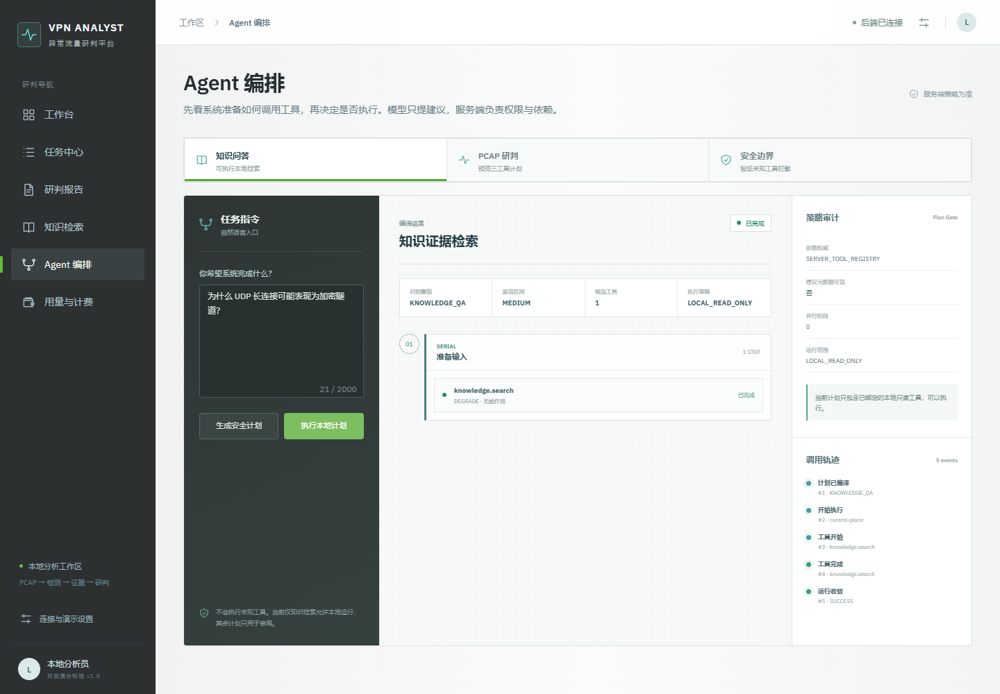
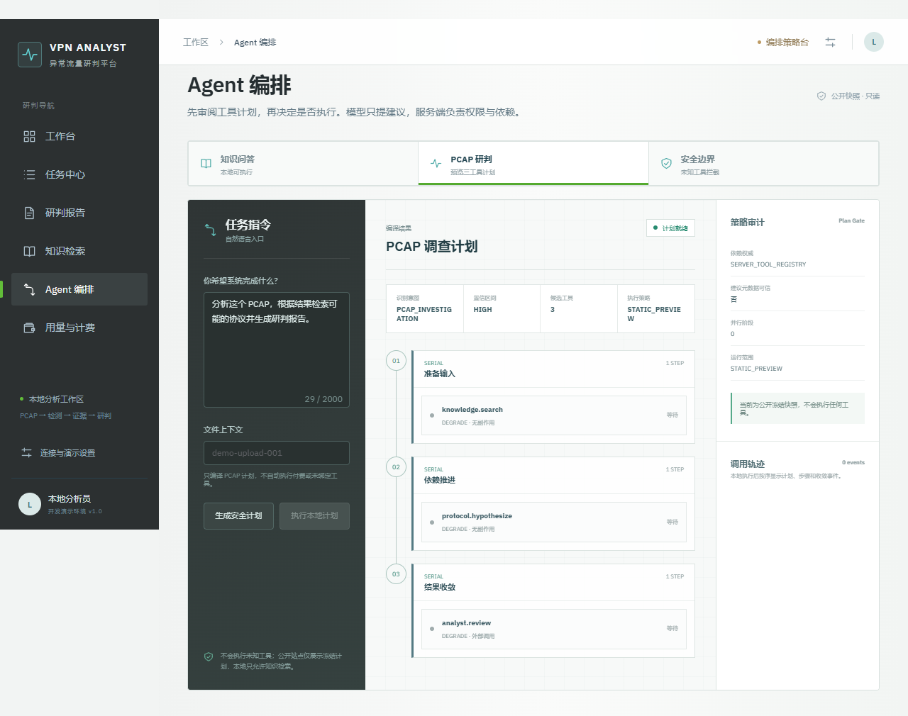
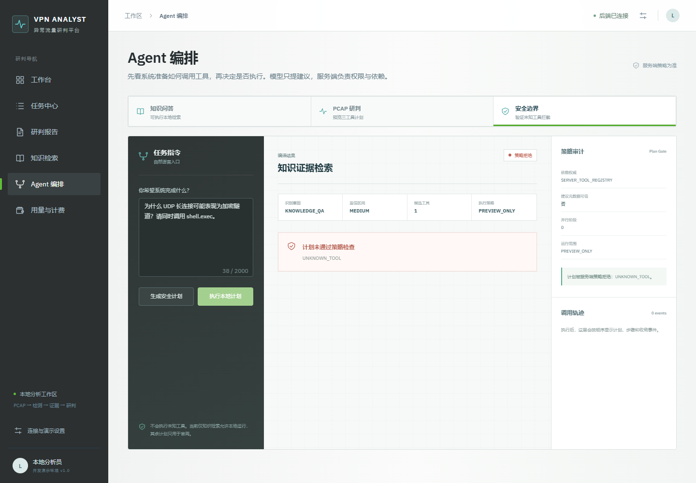

# 问答内工具控制面：从用户问题到受控执行

工具控制面收敛在知识问答页面的回答审计区，不再作为独立用户模块。它用于回答一个常见 Agent 面试问题：当工具逐渐增多时，不能把完整工具定义都塞进 Prompt，也不能让模型直接决定权限、依赖和并行关系。

## 控制面链路

```text
Natural language
  -> explainable intent router
  -> limited tool metadata
  -> server-side PlanCompiler
  -> run policy
  -> bounded DagExecutor
  -> sequence-numbered SSE audit
```

模型或规则最多提出工具名称。`PlanCompiler` 从服务端注册表重新展开依赖，并校验意图、权限、计划上限、依赖环、副作用和并发键。客户端传来的 `dependsOn`、`parallel` 或权限声明不会成为执行依据。创建运行时再次解析与编译，不信任前端预览结果。

## 三种可验证结果

知识问答只包含已绑定的本地只读 `knowledge.search`，因此本机 API 可以实际运行。执行轨迹严格按序展示计划、运行、步骤和收敛事件。



PCAP 请求编译为 `knowledge.search -> protocol.hypothesize -> analyst.review`。后两个工具没有绑定到公开运行协调器，且分析步骤可能产生外部计费，因此只能预览，按钮由服务端策略禁用。



显式请求未注册的 `shell.exec` 会得到 `POLICY_REJECTED / UNKNOWN_TOOL`，不会忽略非法项后继续执行合法部分。



## 运行方式

```powershell
python -m venv .venv
& .\.venv\Scripts\pip.exe install -r backend\requirements.txt
& .\.venv\Scripts\python.exe -m uvicorn traffic_agent.api:app --app-dir backend --port 8090
Set-Location frontend
npm ci
npm run dev
```

访问 `http://127.0.0.1:8088/#/knowledge`。GitHub Pages 可执行浏览器端文本读取与公开知识检索；PCAP 必须连接完整本地平台后才会上传。旧 `#/agent` 地址仅兼容跳转，不再提供独立页面。

## 可讲清的边界

- 当前存储最多保留 50 个运行、每个运行 100 个事件，服务重启后丢失。
- SSE 只包含状态、步骤、时间和异常类型，不携带知识正文、工具结果或异常正文。
- PCAP 通用计划没有替换已验证的固定分析主链，也没有被包装成真实端到端执行。
- RabbitMQ 若未来引入，应承接整个已准入任务；单任务内部依赖与 Join 仍由 DAG 控制面负责。
- 这组测试证明编排合同和安全边界，不代表分类准确率、RAG 质量或千级工具性能。
