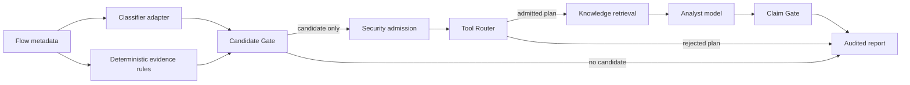

# Architecture and safety boundary

## Runtime flow

The classifier predicts a traffic category; it does not determine maliciousness. The deterministic gate creates
an investigation candidate only when the configured evidence policy is satisfied. Only admitted candidates enter
the Agent context.

## LangGraph state machine

| Node | Responsibility | Failure behavior |
| --- | --- | --- |
| `security_admission` | Cap the batch, pseudonymize network identifiers, remove paths | Reject invalid limits before tool calls |
| `tool_router` | Select registered tools and enforce evidence/dependency policy | Reject the plan and skip all downstream tools |
| `knowledge_retrieval` | Retrieve compact reference snippets | Degrade to an empty result without leaking exception text |
| `analyst_model` | Produce narrative and structured claims | Preserve the deterministic report and return no claims |
| `claim_gate` | Validate claim type, flow scope and evidence IDs | Reject unsupported or ungrounded claims |
| `finalize` | Persist trace and fixed verdict | Always keep `securityVerdict=UNKNOWN` |

The `no candidates` edge short-circuits routing, retrieval and model calls. A candidate with no admitted evidence,
an unknown requested tool, or a missing dependency is also stopped before execution. This saves cost and makes the skip visible in
the trace rather than hiding it as a successful model response.

An additive generic control-plane demo treats model output as a tool-name proposal, not an executable plan. `PlanCompiler` rebuilds
dependencies, permissions, failure policy, side-effect constraints and topology from the server registry. `DagExecutor`
then runs dependency stages with bounded in-process concurrency. This local implementation demonstrates deterministic
fan-out/join semantics; it has not replaced the stable six-node runtime graph and is not a distributed scheduler or a scale benchmark.

## Claim contract

Allowed claim types are `OBSERVATION`, `INVESTIGATE`, and `LIMITATION`. The gate rejects `MALICIOUS`, `BENIGN`,
`BLOCK`, `ALLOW`, and `AUTO_REMEDIATE`. An `INVESTIGATE` claim must refer to an admitted candidate and at least one
medium or strong item belonging to the same flow.

Free-form narrative is retained for analyst usability but marked `UNVERIFIED_NARRATIVE`; only structured claims are
machine-validated. This limitation is displayed in the UI and exported in the audit artifact.

## Document retrieval

Self-authored Markdown files in `backend/traffic_agent/knowledge_docs` are split on second-level headings.
Each chunk carries a content-derived ID, source filename, section, corpus version and SHA-256 of the source.
The tokenizer uses English terms and overlapping Chinese bigrams. BM25 uses k1=1.5 and b=0.75.
Candidate evidence codes form the Agent query. No matching terms means no hits.

The fixture generator exports this corpus to the browser. Python and JavaScript scores and rankings are
compared in CI on eight queries, including blank and unmatched inputs. This is implementation consistency
testing. A separate versioned development set reports Hit@1, Hit@3, MRR, out-of-domain rejection,
conversation resolution and citation-contract checks. It is intentionally labelled as a development regression set,
not an independent quality benchmark. Dense retrieval, reranking and graph queries remain future work.

## Public-repository contents

The public repository includes the orchestration, controls, tests, synthetic fixture and UI. It does not include a
trained detector, packet capture, private data, internal knowledge text, organization-specific code, or credentials.
`DemoSequenceClassifier` only demonstrates the adapter contract and must not be interpreted as a trained model.
