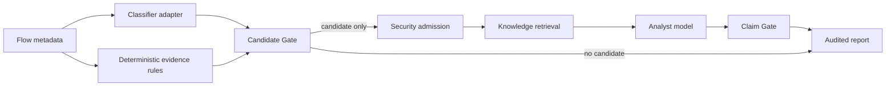

# Architecture and safety boundary

## Runtime flow

The classifier predicts a traffic category; it does not determine maliciousness. The deterministic gate creates
an investigation candidate only when the configured evidence policy is satisfied. Only admitted candidates enter
the Agent context.

## LangGraph state machine

| Node | Responsibility | Failure behavior |
| --- | --- | --- |
| `security_admission` | Cap the batch, pseudonymize network identifiers, remove paths | Reject invalid limits before tool calls |
| `knowledge_retrieval` | Retrieve compact reference snippets | Degrade to an empty result without leaking exception text |
| `analyst_model` | Produce narrative and structured claims | Preserve the deterministic report and return no claims |
| `claim_gate` | Validate claim type, flow scope and evidence IDs | Reject unsupported or ungrounded claims |
| `finalize` | Persist trace and fixed verdict | Always keep `securityVerdict=UNKNOWN` |

The `no candidates` edge short-circuits retrieval and model calls. This saves cost and makes the skip visible in
the trace rather than hiding it as a successful model response.

## Claim contract

Allowed claim types are `OBSERVATION`, `INVESTIGATE`, and `LIMITATION`. The gate rejects `MALICIOUS`, `BENIGN`,
`BLOCK`, `ALLOW`, and `AUTO_REMEDIATE`. An `INVESTIGATE` claim must refer to an admitted candidate and at least one
medium or strong item belonging to the same flow.

Free-form narrative is retained for analyst usability but marked `UNVERIFIED_NARRATIVE`; only structured claims are
machine-validated. This limitation is displayed in the UI and exported in the audit artifact.

## Public-repository boundary

The public repository includes the orchestration, controls, tests, synthetic fixture and UI. It does not include a
trained detector, packet capture, private data, internal knowledge text, organization-specific code, or credentials.
`DemoSequenceClassifier` only demonstrates the adapter contract and must not be interpreted as a trained model.
