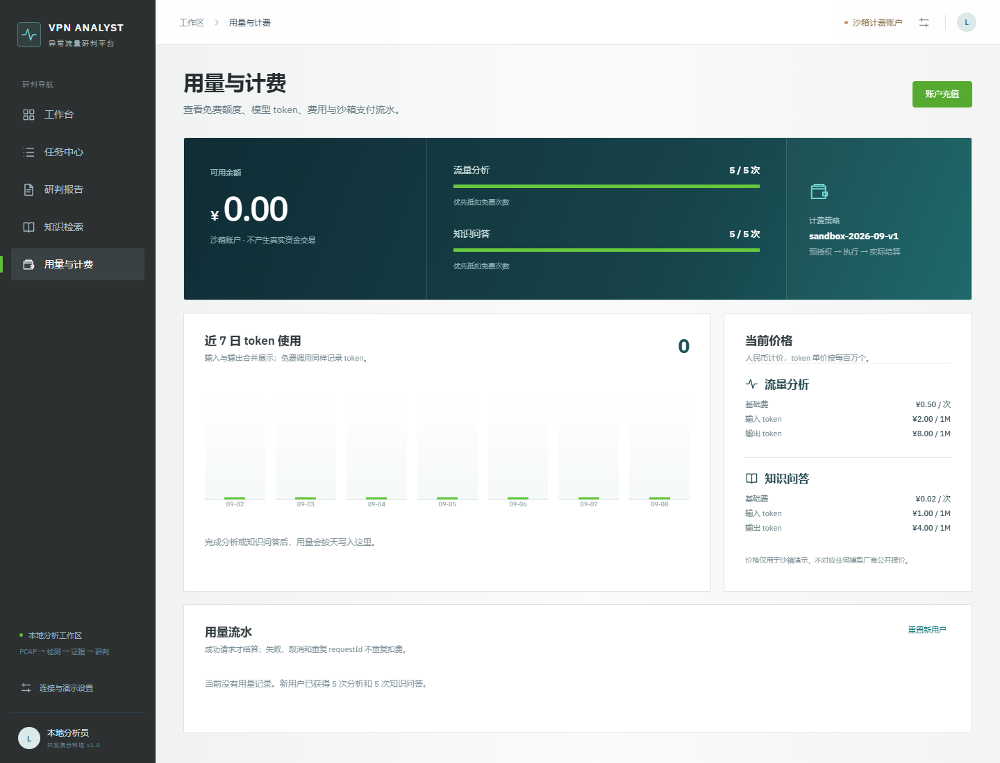
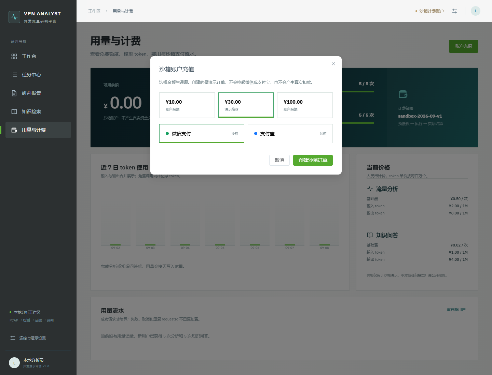

# 用量与沙箱计费

## 目标

这个模块用于展示 AI 应用在调用前后的成本治理，而不是接入真实支付。它把一次分析或知识问答拆成：

1. `authorize`：检查免费次数或余额，并预留最大 token 成本。
2. 执行：调用确定性 Agent、检索或可选的 DeepSeek 上游。
3. `settle`：按实际输入/输出 token 结算，退回未使用预留金额。
4. `release`：失败、取消或超时释放免费次数或余额预留。

## 演示能力

- 新用户分别获得 5 次 `ANALYSIS` 和 5 次 `KNOWLEDGE_QA` 免费额度。
- `requestId` 作为幂等键，重复请求不会重复扣费。
- 用量记录包含 operation、billing mode、prompt/completion/total tokens、price version 和时间。
- 公开站的浏览器 ledger 使用 localStorage，便于 GitHub Pages 无后端运行。
- API 提供 `GET /api/billing/summary`、`POST /api/billing/orders` 和 `POST /api/billing/orders/{id}/simulate-paid`。
- 支付通道展示为 `WECHAT` 与 `ALIPAY`，订单状态为 `PENDING -> PAID`，支付按钮只模拟合法回调。

## 页面证据

桌面端展示余额、两类免费额度、价格版本、近 7 日 token 柱状图和用量流水：

充值弹窗明确标注微信/支付宝为沙箱，不伪装成真实支付页面：

## 价格口径

当前价格版本为 `sandbox-2026-09-v1`。基础费与 token 单价是项目自定义的演示值，不是任何模型厂商的公开报价。价格、免费额度和最大 token 预算在后端与前端演示账本中保持同一版本，避免页面显示和实际扣费不一致。

## 真实系统还需要什么

真实微信/支付宝接入不能用浏览器按钮直接改余额，至少需要服务端创建预支付订单、商户证书和签名校验、异步回调验重、支付状态机、退款、对账、风控、订单过期处理和统一用户身份。生产环境还应把内存/浏览器 ledger 换成数据库事务与消息可靠性方案。本项目没有实现这些能力，也没有保存支付密钥。

## 验证

`backend/tests/test_billing.py` 覆盖免费额度边界、失败释放、实际结算退款、重复 requestId、沙箱订单幂等和 API 余额不足；`frontend/tests/billing.test.js` 覆盖浏览器 ledger、充值幂等和日统计。页面验证过充值后余额、知识问答免费次数减少和用量流水展示。
