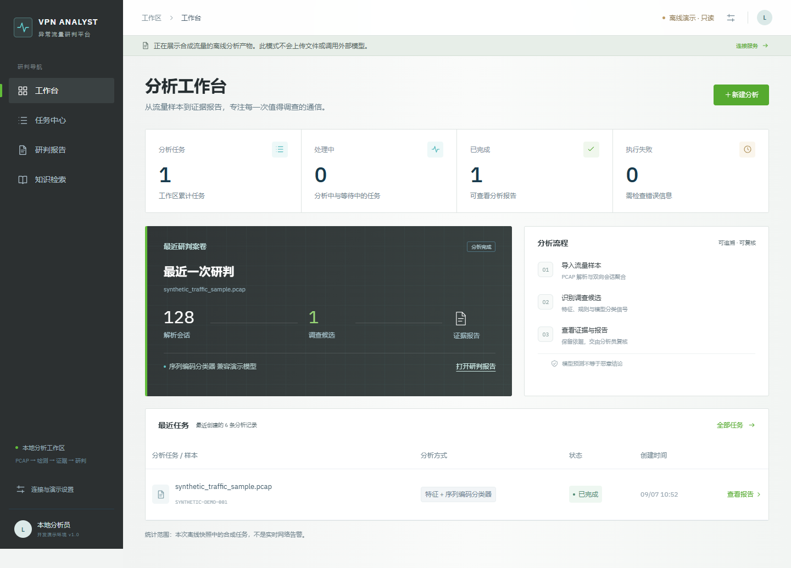
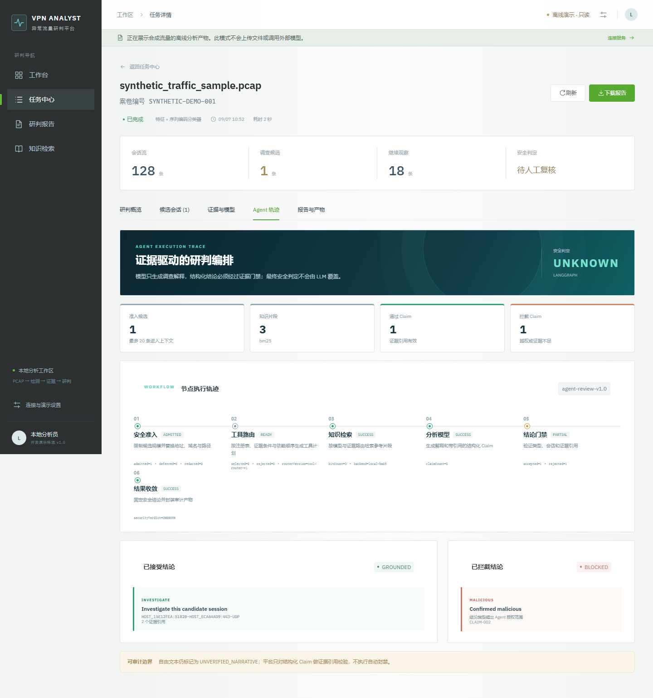
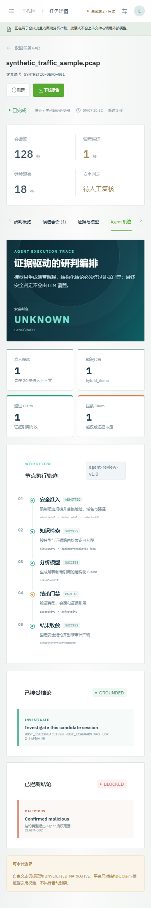
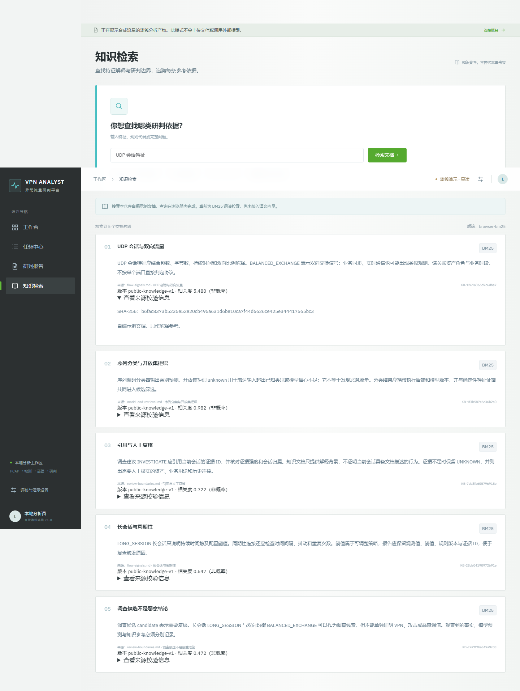
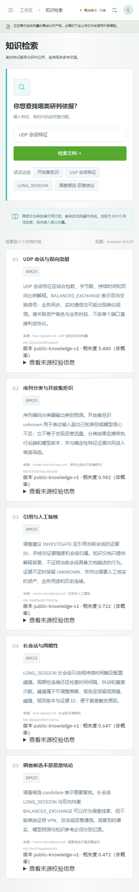
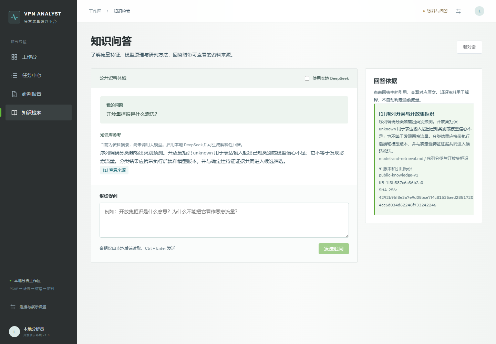
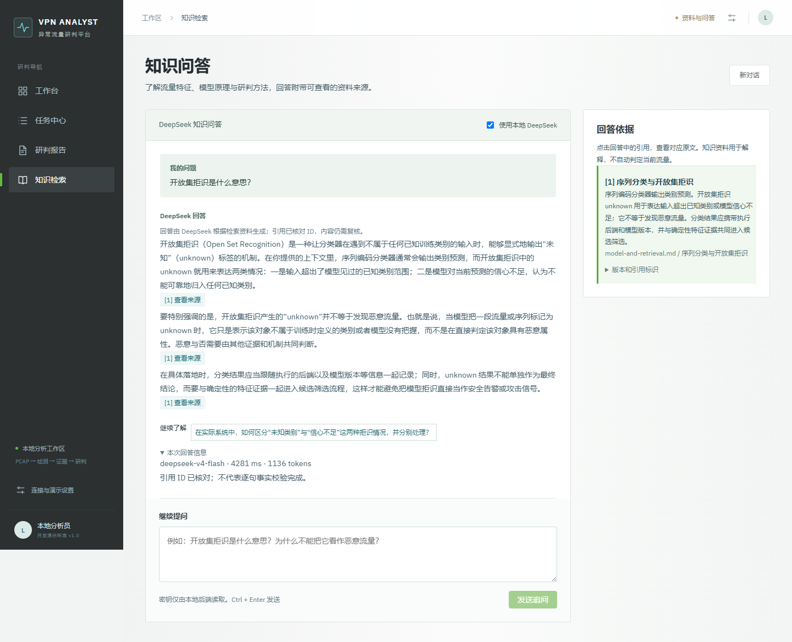

# 从长页面到安全研判工作区：一次 Skill 驱动的前端重构

## 问题

最初页面把上传、任务进度、结果、知识片段和报告全部堆在一个纵向页面。它能展示数据，却不符合分析员
“先找到任务，再核验证据，最后形成结论”的工作节奏。移动端更需要连续滚动，模型边界也容易被埋在大量
指标下面。

## 设计方法

我使用前端设计 Skill 先明确视觉方向和信息优先级，再写 Vue 组件，而不是先套一个后台模板。重构遵循四个
约束：任务和报告分离；结论与证据分层；模型预测不等于安全判定；桌面与移动端使用同一套信息结构。

视觉上采用深灰蓝导航、低饱和内容区、青色技术状态与绿色主操作。Element Plus 负责稳定的表格、标签页、
表单和反馈组件，项目 CSS 负责品牌化层级、轨迹视觉和响应式排版。这样保留了组件库的工程效率，也避免界面
变成默认组件拼贴。

## Agent 轨迹页

Agent 页面不是装饰性流程图，它直接消费后端保存的 `trace` 和 `claimAudit`：顶部固定显示 `UNKNOWN` 安全
判定，中部呈现每个 LangGraph 节点状态，底部并排展示通过和被拦截的 Claim。示例故意生成一条
`MALICIOUS` Claim，用来证明门禁真的会拒绝越权结论。

移动端把横向五节点轨迹改成纵向时间线，指标卡变为两列，审计卡片单列排列。浏览器自动化分别在 1440px
和 390px 视口执行，并检查控制台错误。

## 可验证结果

- Vue 3、Pinia、Vue Router、Element Plus 和 Vite 构成可运行的前端。
- 离线模式默认使用合成 fixture，不上传文件、不调用外部模型。
- Playwright CLI 验证桌面和移动端关键路径，两个视口均无控制台错误。
- GitHub Pages 工作流每次从生成脚本重建 fixture，再构建静态站点，避免手工维护截图数据。
- Element Plus 改为按需加载后，最大 JS 块由约 922 KB 降至约 198 KB，主 CSS 由约 391 KB 降至约 115 KB。

这次重构的重点不是“页面更绿”，而是让系统边界变得可见：哪里是事实、哪里是模型信号、哪里只是建议，
以及 Agent 拒绝了什么，都能被面试官和使用者直接核验。

## 后续迭代：让知识页可以操作

最初公开版知识页被禁用，只能看报告里固定的知识片段。本轮加入自编 Markdown 文档与 BM25 检索，
让访问者输入问题后看到实际排序结果。浏览器在本地计算，GitHub Pages 不需要部署服务器。
Python Agent 使用相同文档、分词和评分公式，CI 比较两端排序与分数，防止前端展示与后端行为不一致。

每条结果展示标题、正文、来源章节、版本、切片 ID 与原文哈希。相关度标明“非概率”，未匹配时返回空结果。
页面说明当前为词法检索，避免将其包装为已完成的向量检索或语义理解。

手机端把查询框和按钮纵向排列，来源哈希允许换行；Playwright 验证查询、来源展开、空结果及无横向溢出。

## 知识问答迭代

知识模块进一步明确为用户输入问题、获取解释并继续追问的领域问答。主栏呈现对话，侧栏查看引用原文，
不要求用户先填写研判表单。入口提供流量特征、模型原理、研判方法与知识检索四类问题示例。
新增 vpn-knowledge-qa 运行时 Skill，规定直接回答、解释边界和逐段来源引用；DeepSeek 接口负责生成，
Python 负责结构与引用 ID 校验。公开站继续标记原文摘录，不冒充模型生成。

完成本地 DeepSeek 真实请求后的界面如下，显示生成回答、来源引用和模型用量。

浏览器回归脚本 `tools/check_knowledge_qa.js` 验证提问、追问、引用定位、新对话、无结果、缺少密钥提示
与手机端无横向溢出。后端 HTTP Mock 覆盖超时、空内容、JSON 截断与未知引用；真实模型质量需要独立验收。
