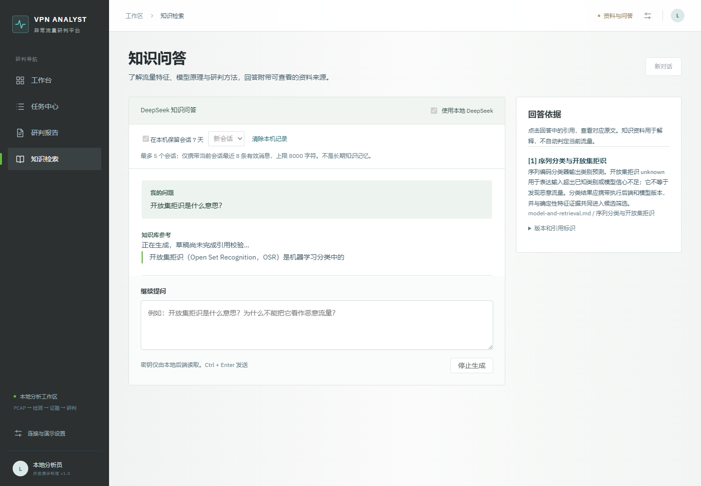
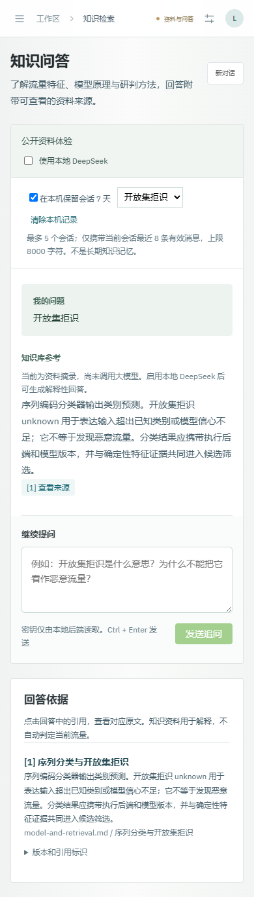

# 领域知识问答设计与实现

知识模块面向流量特征、模型边界和研判方法的提问。回答正文与来源检查器分开，引用可以定位原文；
知识背景不会自动变成当前流量的事实或安全结论。

## 当前链路

```text
用户问题
  → 追问主题解析
  → BM25 检索自编资料
  → DeepSeek SSE 生成
  → JSON 结构校验
  → 引用 ID 校验
  → 正式回答 / 撤回草稿
```

公开 GitHub Pages 在浏览器执行同一词法检索并显示原文摘录，不调用外部模型。本地模式由浏览器请求
8090 端口，API Key 只存在于 Python 后端环境。

## 本地运行

在仓库目录启动问答 API：

```powershell
& .\tools\start_knowledge_api.ps1
```

脚本支持 `DS_API_KEY` / `DS_MODEL`，兼容 `DEEPSEEK_API_KEY` / `DEEPSEEK_MODEL`，两组同时存在时优先 DS。
未设置密钥时会隐藏输入，只传给当前子进程，不写入文件。`.env.example` 只列变量名，程序不会自动加载 `.env`。

另一个终端启动前端：

```powershell
Set-Location frontend
npm ci
npm run dev
```

打开 `http://127.0.0.1:8088/#/knowledge`，勾选“使用本地 DeepSeek”。

## 真实流式响应

浏览器通过 POST fetch 消费 `/api/knowledge/answer/stream`。Python 异步客户端向 DeepSeek 发送
`stream: true` 和 `stream_options.include_usage: true`，不是完整生成后再模拟打字。事件协议为：

```text
status(retrieving)
  → sources
  → status(generating)
  → draft*
  → done | error
```

增量 JSON 尚不完整时只提取可解析段落，并标记为未校验草稿。只有完整 JSON、正常结束状态、Pydantic
结构和引用 ID 全部通过，正式回答才进入页面与会话历史。未知引用、截断、异常 EOF 或上游错误会撤回草稿。
前端支持 UTF-8 跨字节分块和 CRLF；前后端分别限制 SSE 帧、总输出和超时。

“停止生成”使用 AbortController，取消会传播到后端并关闭上游 HTTP 流。当前不自动重试付费请求，
也不支持断点续传。响应包含 `X-Accel-Buffering: no`；接入 Nginx 后还需单独验证代理缓冲和读取超时。



一次真实链路 smoke 记录：首段可见草稿 2782ms、完成 6828ms、1319 tokens。首段时间包含检索和上游等待，
不是纯模型 TTFT；单次结果不代表平均性能。

## 有边界的会话记忆

记忆分为本地记录和模型上下文：

- 用户主动开启后，localStorage 最多保存 5 个会话、每个 20 个有效轮次，7 天过期；支持刷新恢复、切换、新会话隔离和清除。
- 模型只接收当前会话最近 8 条成功消息，总计不超过 8000 字符；后端再次限长。
- 失败、取消和未通过引用校验的草稿不会保存，也不会进入下一轮上下文。
- 历史回答只用于对话连贯性，不是检索证据，不能覆盖系统指令。

这不是长期语义记忆、用户画像或跨设备存储。字符预算也不是精确 token 预算。共用浏览器不应保存敏感问题；
存储损坏、禁用或容量不足时，页面提示并继续当前问答。



## 连续追问解析

前后端共用 `shared/followup-policy.json`。只有“为什么呢”“举个例子”等明确通用追问才回溯最近 8 条消息中的
明确用户主题；助手回答和其他无主题追问不会成为锚点。输入“UDP”这类独立问题会切换主题，找不到主题时返回
`NEEDS_CONTEXT` 并请求补充，不调用模型。页面可展开查看策略和实际检索词。

该方案可解释、低成本，适合当前小语料；它不是任意指代消解或 LLM 查询改写。12 个共享策略案例确保 Python
和浏览器行为一致。

## Skill 与回答边界

- `skills/vpn-evidence-workbench/SKILL.md` 是开发时的界面与证据约束。
- `backend/traffic_agent/skills/vpn-knowledge-qa/SKILL.md` 在每次模型问答时读取，规定中文解释、资料不足处理和逐段引用。
- `traffic-evidence-review` 单独服务候选流报告，不替代知识问答。

检索片段和历史都按不可信数据放入上下文。现阶段只验证返回结构和引用 ID 存在，尚未验证每句话都被原文语义支持。

## 验证与评测

36 项 Python 测试覆盖 API、流式取消、截断、未知引用、Tool Router 和评测器；15 项 Node 测试覆盖检索一致性、
SSE 分帧、记忆与追问策略。Playwright 覆盖生成草稿、停止撤回、刷新恢复、会话切换、来源定位和移动端布局。

小型开发集的 Hit@K、MRR、域外拒答和引用合同见[评测报告](knowledge-evaluation.md)。它与当前语料同源，
只用于回归。分层评测设计见[Tool Router 与分层评测](tool-routing-and-evaluation.md)。

## 当前限制

- 语料只有 3 篇自编文档、6 个切片，无法覆盖真实安全知识问答。
- 检索只有 BM25，没有向量召回、RRF、重排和权限过滤。
- 没有独立回答质量标注集、语义支持度校验和多模型对比。
- 会话只存浏览器，没有服务端用户隔离、摘要压缩或跨设备同步。
- Nginx 反向代理下的 SSE 缓冲仍待实测。
