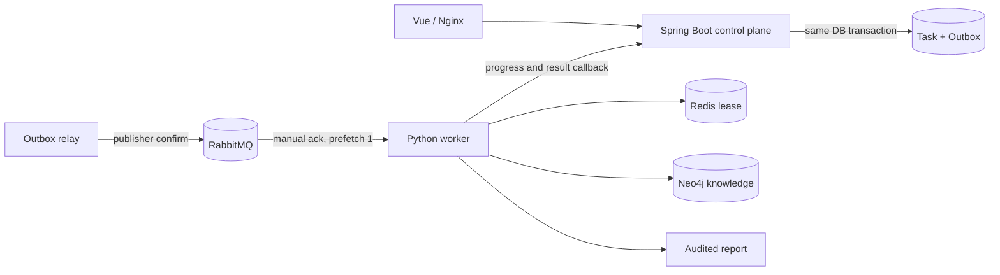
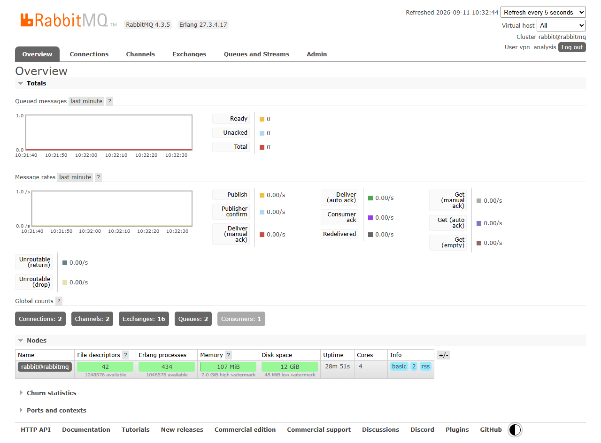

# 从同步调用到可恢复任务：RabbitMQ、Redis与Neo4j集成实录

这篇文章记录完整本地平台的一次工程化迭代。公开仓库仍只包含脱敏的 Agent、知识问答、评测和 Vue 展示切片，不包含 PCAP、训练模型、私有文档、完整 Java 控制面或运行凭据。

## 问题不是“加三个中间件”

PCAP 解析、特征计算和报告生成可能持续几十秒。同步 HTTP 调用会长期占用请求线程，Python 服务重启还会让控制面无法判断任务究竟是未发送、处理中还是已经完成。知识检索则需要同时保存原文来源和实体关系，单个 JSON 文件便于演示，但不利于图查询和索引演进。

本轮把问题拆为三个职责：

- RabbitMQ 负责跨 Java/Python 服务投递长任务和削峰。
- Redis 负责短期执行租约与完成标记，降低重复投递带来的重复执行。
- Neo4j 负责文档、切片、主题和实体提及关系，以及全文/可选向量索引。



## 事务Outbox解决双写窗口

直接“先写数据库，再发 MQ”会留下数据库成功、消息失败的窗口；反过来则可能让消费者看到尚未提交的任务。完整平台让任务与 Outbox 事件在同一事务提交，Relay 扫描到期事件并等待 Publisher Confirm，确认后才把事件标记为已发布。

这不是端到端恰好一次。Broker 已接收消息但 Relay 尚未更新数据库时仍可能重复发布，所以消费端继续做幂等。工程语义是“至少一次投递 + 业务幂等”，而不是难以兑现的 exactly-once 宣称。

## ACK、DLQ与Redis幂等

Worker 使用 durable queue、持久化消息、手动 ACK 和 `prefetch=1`。任务完成并写入 Redis 完成标记后才 ACK；非法消息、并发重复或执行异常使用 `NACK(requeue=false)` 进入 DLQ。

Redis 锁采用随机 token、`SET NX EX` 和 Lua 原子释放。Lua 会先比较锁持有者，再写完成标记并删除租约，避免一个超时 Worker 删除另一个 Worker 新获得的锁。最终任务状态仍在关系数据库中，Redis 不是审计事实源。



截图来自完成真实任务后的本地虚拟机：RabbitMQ 4.3.5，2 个队列，1 个消费者，Ready 与 Unacked 都为 0。截图账号仅有项目 vhost 权限，拍摄后已撤销临时监控标签并轮换密码。

## Neo4j既存文档也存关系

“知识库”是能力，“图数据库”是实现技术。完整平台采用以下最小模型：

```text
(Document)-[:HAS_CHUNK]->(Chunk)
(Chunk)-[:TAGGED_AS]->(Topic)
(Chunk)-[:MENTIONS]->(Entity)
```

`MENTIONS` 只表达文档片段提到了实体，不把共现伪装成已验证领域事实。只有经过规则或人工审核后，才适合增加 `USES`、`HAS_FEATURE` 或 `MAY_FALSE_POSITIVE` 等强关系。

本次实际导入结果：

| 项目 | 数量 |
|---|---:|
| 来源文档 | 14 |
| 知识切片 | 1827 |
| 受控实体 | 19 |
| 实体提及关系 | 1332 |
| 主题关系 | 5439 |

全文索引已在线，查询结果保留稳定 chunk ID、来源和切片序号。当前尚未导入向量；检索器会先检查向量索引是否在线，不存在时只走全文通道并明确标记降级，不调用付费 Embedding API。

## 一次只有真实调用才会发现的缺陷

服务健康检查和 Neo4j 连通性都正常，但第一次检索仍回退到 JSONL。根因是 Python 执行方法的形参也叫 `query`，与 Cypher 参数 `$query` 重名，调用时触发重复参数绑定。将方法形参改为 `cypher` 并加入回归测试后，接口才真正返回 Neo4j 结果。

这说明“容器已启动”“端口可连接”“单元测试通过”都不能替代业务级 smoke test。最终验收必须从用户输入走完整链路，并检查数据库状态、队列积压、幂等标记和输出来源。

## 为什么选RabbitMQ而不是Kafka

当前负载是人工提交的离散分析任务，不是持续海量事件流。需求重点是消费者确认、死信隔离、有限并发和低运维成本；Kafka 的长日志保留、回放和多下游吞吐优势在这里没有形成收益。若未来出现持续流量事件、多个实时下游或长期事件回放，再重新评估 Kafka，而不是为了技术栈数量提前引入。

## 实测与边界

完整本地平台使用一个约 73.5 MB 的 PCAP 跑通：任务依次进入解析和分析阶段，最终 `SUCCESS/COMPLETED`；Outbox 为 1 条已发布、0 条待发布、0 条失败；主队列和 DLQ 均无积压；Redis 完成标记存在。Python 全量 123 项测试、Java 7 项测试通过。

仍未完成的部分同样重要：

- 消费失败当前直接进入 DLQ，尚无 TTL 延迟重试队列。
- 分析结果仍通过 HTTP 回调控制面，尚未拆成结果事件队列。
- Java 本地演示仍使用 H2，MySQL 主链迁移和 Flyway 尚未完成。
- 文件仍使用本地存储，MinIO 适配尚未完成。
- Neo4j 向量索引和全文/向量 RRF 尚未做真实双通道验收。

这套实现的价值不是假装已经生产上线，而是能解释每个中间件解决的具体一致性问题，并用可重复任务、队列状态、索引状态和测试证明关键链路确实运行过。
